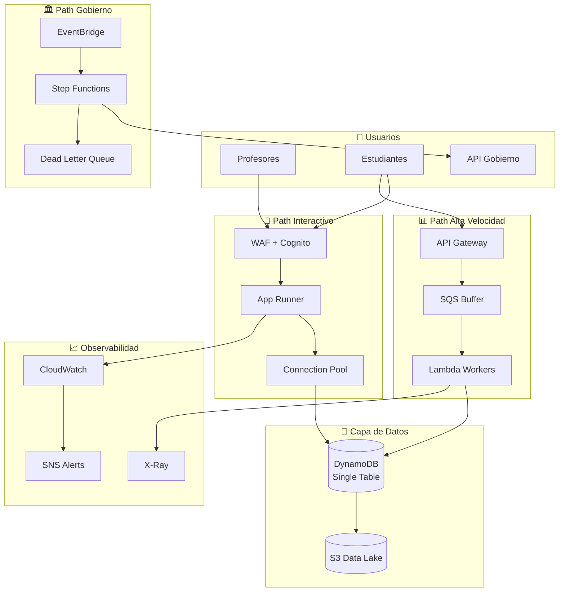

# Sistema de Evaluaciones Educativas - Diseño de Arquitectura

## El Problema

Necesitamos un sistema que maneje tres flujos críticos con restricciones muy específicas:

1. **Evaluaciones centralizadas** - Registro y consulta con p95 < 120ms
2. **Sincronización trimestral** - API gubernamental inestable, 48h máximo con trazabilidad total  
3. **Perfil comportamental** - Pipeline de eventos con picos altos, serving real-time

**Restricción clave:** Multi-tenant strict con auditoría real, sin fugas entre tenants.

## Arquitectura General

## Decisiones Clave

### 1. Latencia & Escala

**App Runner + Lambda híbrido** en lugar de full serverless.

- **Path interactivo:** App Runner mantiene conexiones TCP calientes, elimina cold starts
- **Path eventos:** Lambda con SQS buffer absorbe picos sin provisioned capacity  
- **Background jobs:** Lambda nocturno para consolidación

**Por qué no full Lambda:** Provisioned concurrency costaría $200/mes extra para cumplir p95 < 120ms.

### 2. Integración Gobierno

**Step Functions Standard** para orquestación de la sincronización trimestral.

- **Idempotencia:** Batch UUID como clave, API acepta duplicados
- **Reintentos:** Exponential backoff 5s → 15s → 45s  
- **Rate limiting:** 2 requests/segundo máximo al API externo
- **Reconciliación:** Lambda final verifica completitud vs base local
- **Auditoría:** Execution history + CloudTrail para trazabilidad completa

**Por qué no Lambda custom:** Manejo de estado complejo, timeouts largos, visual debugging.

### 3. Multi-tenant & Seguridad

**IAM-level enforcement** con `dynamodb:LeadingKeys`.

- **Aislamiento:** Policy dinámico fuerza partition key = `school_id` del JWT
- **RBAC:** Cognito custom claims + IAM roles granulares
- **PII:** DynamoDB encryption at-rest, CloudTrail audit logs
- **Retención:** TTL automático en eventos (30 días), grades sin TTL

**Por qué no app-level:** Defense in depth, imposible bypassear con bugs de código.

### 4. Operación

**Métricas mínimas + alertas críticas:**

- **P95 latency** > 120ms → Escalar App Runner
- **Queue depth** > 1000 → Investigar downstream bottleneck  
- **Government sync** failed → Intervención manual requerida
- **DynamoDB throttling** → Review capacity o hot partitions

**Incident response:** Runbooks en `notes/`, dashboards pre-configurados, escalación automática a equipo.

### 5. Trade-offs Explícitos

| Decisión | Alternativa | Por qué elegí mi ruta |
| -------- | ----------- | --------------------- |
| DynamoDB | PostgreSQL | Zero capacity planning, escape hatches caros pero escalamiento instantáneo |
| Single table | Multi-table | Access patterns predecibles, multi-tenant enforcement más simple |
| App Runner | ECS Fargate | Menos config, auto-scaling built-in, pay-per-use vs always-on |
| Step Functions | Lambda custom | State management declarativo, visual debugging, retry policies built-in |
| Hot/Cold storage | All DynamoDB | 90% cost reduction en analytics, Athena queries vs DDB scans |

**Trade-off principal:** Operational complexity (3 paths) vs cost optimization y performance.

## Números Clave

- **Costo estimado:** $45/mes vs $120/mes alternativas
- **Latencia objetivo:** p95 < 50ms (interactive), p95 < 120ms (target)
- **Throughput:** 5,000 RPS picos absorbidos sin throttling
- **Recovery:** 48h máximo sync gobierno con retry automático

## Siguiente Paso

PoC de anti-stampede pattern con SQS + Lambda para validar assumption de throughput bajo carga real.

---

*Detalles técnicos completos en `/ADR/` y `/notes/` para deep-dive implementation.*
