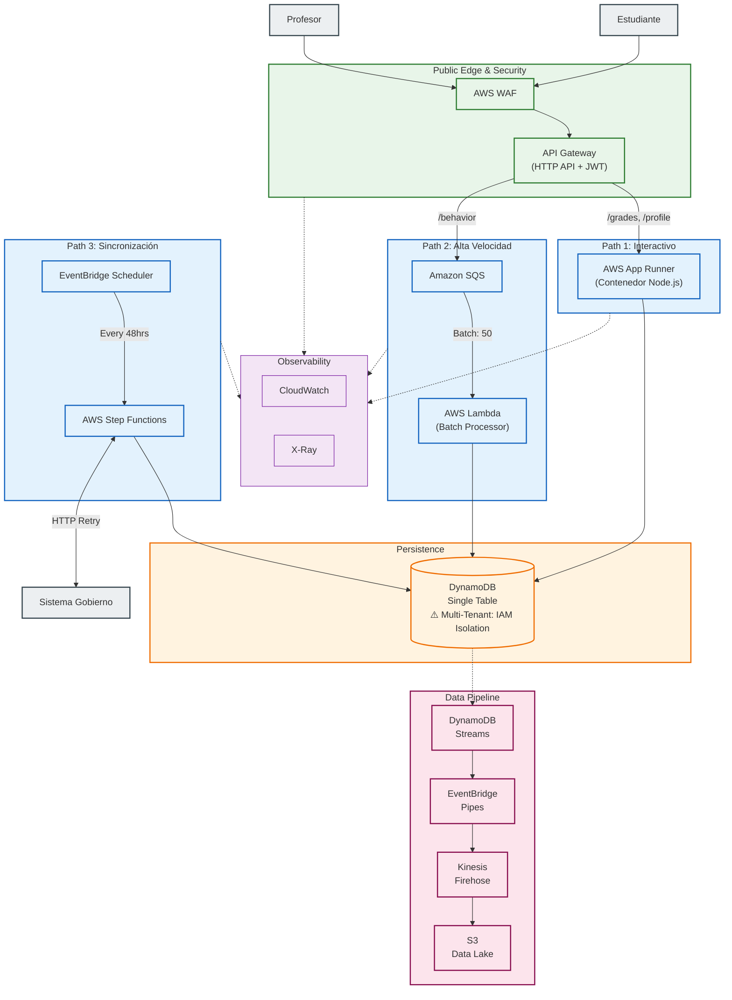

# Home Assessment: Architecture & Design Strategy

## 1. Principios de Diseño

Mi diseño busca ser pragmático. Estas son mis motivaciones para cada decisión:

* **Simplicidad Operativa:** Priorizo productos gestionados (Managed Services) en lugar de gestionar infraestructura propia. Evito Kubernetes o clusters de Kafka. Busco que los equipos se enfoquen en el producto, no en manejar infraestructura.
* **Serverless, donde haga sentido:** Uso Serverless (Lambda, SQS) para tráfico impredecible y masivo tratando de proteger costos. Uso contenedores en App Runner donde la latencia en *cold start* es crítica, evitando pagar *provisioned concurrency* en Lambda.
* **Developer Experience:** Busco reducir la complejidad mental del equipo (y la mía) separando ciertos dominios y evitando cadenas de Lambdas difíciles de monitorear, entre otros.
* **Resiliencia por diseño:** Siempre desarrollo pensando en que las piezas van a fallar.
* **Compliance y Seguridad:** La protección de datos (PII de menores) y el aislamiento entre escuelas (Multi-tenant) se manejan a nivel infraestructura e IAM. Es inaceptable que un tenant vea datos de otro.
* **Simplicidad:** Trato de no hacer sobre ingeniería, pero dejando margen para iteraciones cercanas.

## 2. Suposiciones (Key Assumptions)

Asumí y llené con mi imaginación educadamente bastantes gaps en la descripción del problema. Estas son algunas de las suposiciones que tomé:

* **Perfil de Tráfico:** Predecible pero explosivo. Se concentra de Lunes a Viernes de 7:00 a 12:00 hrs.
* **Volumen:** Por poner un número para dimensionar, definí "picos altos" como **~5,000 RPS** durante eventos masivos.
* **Latencia:** El requerimiento de **p95 < 120ms** implica que la lectura interactiva (ver perfil, dashboard) y el cálculo de notas deben ser en tiempo real. La ingesta de comportamiento puede ser de consistencia eventual.

## 3. Arquitectura del Sistema

### Estrategia de Separación de Dominios

Separé el sistema en **tres paths de ejecución** basándome en sus perfiles de tráfico y requerimientos de latencia:

**Path 1 (Interactivo):** Operaciones síncronas como consulta de perfiles y cálculo de notas. Usé contenedores persistentes (App Runner) en lugar de funciones efímeras para mantener conexiones activas a la base de datos y reglas de negocio cargadas en memoria. Esto elimina cold starts y garantiza latencias estables bajo el target de p95 < 120ms.

**Path 2 (Alta Velocidad):** Ingesta masiva de eventos de comportamiento estudiantil (~5,000 RPS en picos). API Gateway escribe directamente a SQS sin lambda intermedia, reduciendo costo y latencia. Lambda workers procesan en lotes de 50 mensajes, optimizando escrituras a DynamoDB mediante `BatchWriteItem`. La cola actúa como buffer anti-stampede protegiendo el resto del sistema.

**Path 3 (Sincronización):** Integración con el sistema del gobierno usando Step Functions para manejar la naturaleza inestable del API externo. La máquina de estados coordina reintentos con backoff exponencial, esperas largas sin consumir recursos, y mantiene auditoría completa del proceso de sincronización.

**Multi-Tenancy:** El aislamiento entre escuelas se garantiza a nivel IAM usando `dynamodb:LeadingKeys` en las políticas de acceso. Esto previene que un tenant acceda datos de otro incluso si existe un bug en la lógica de aplicación—crítico para compliance con datos de menores.

**Observabilidad:** CloudWatch centraliza logs estructurados (JSON) con correlation IDs que permiten seguir una transacción completa a través de todos los componentes. X-Ray provee trazabilidad distribuida para análisis de latencia y debugging.

**Data Pipeline:** DynamoDB Streams captura todos los cambios en la base de datos. EventBridge Pipes filtra y transforma los eventos antes de enviarlos a Kinesis Firehose, que los archiva en S3 en formato Parquet para auditoría y análisis posterior—sin escribir código ETL custom.