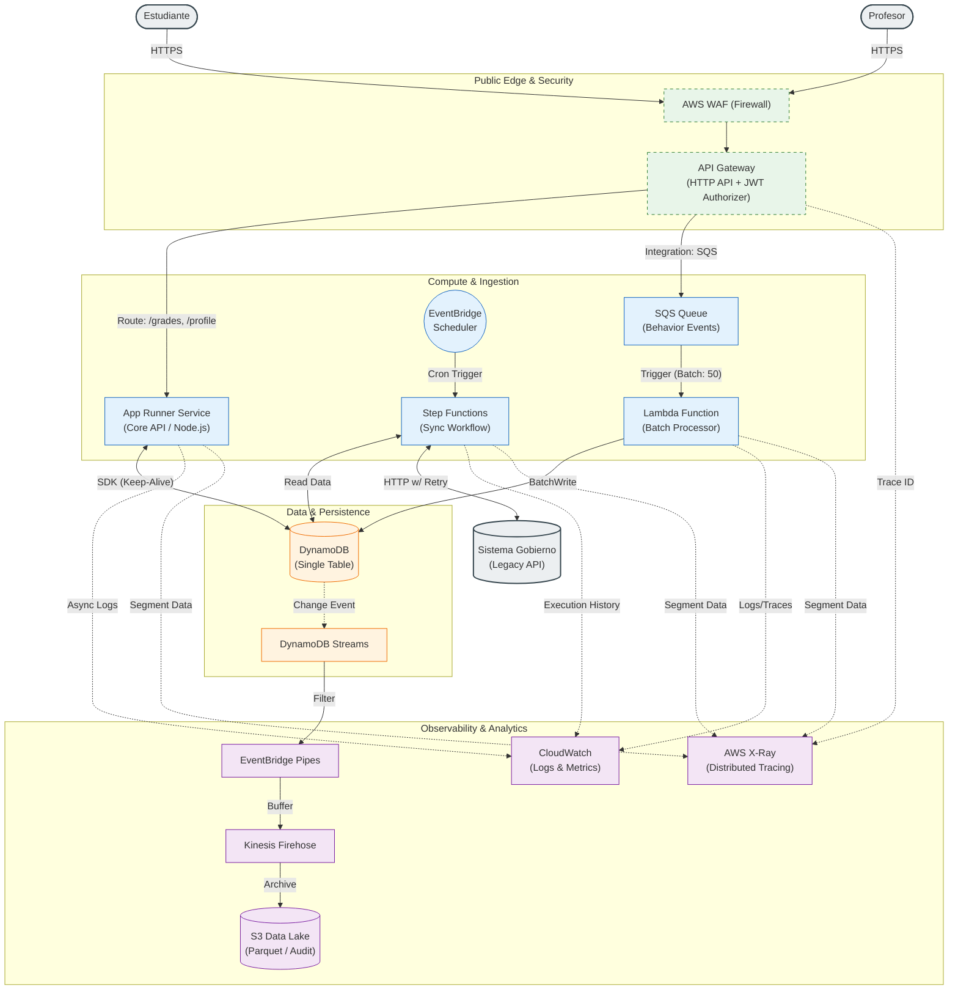
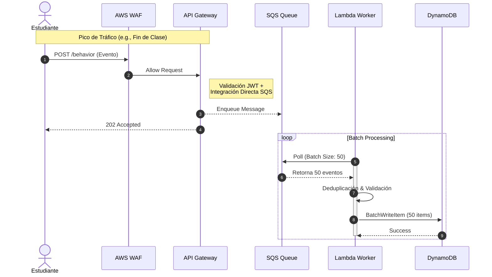
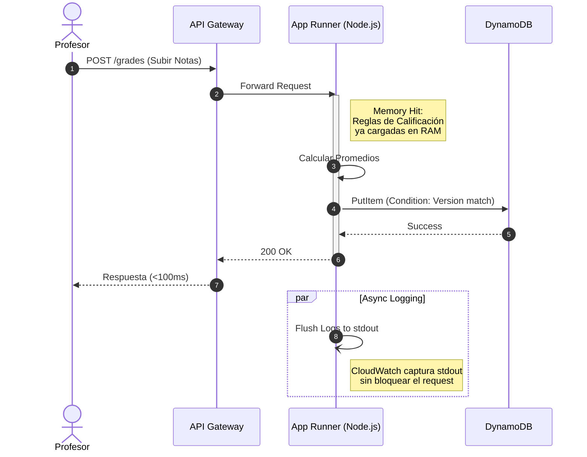
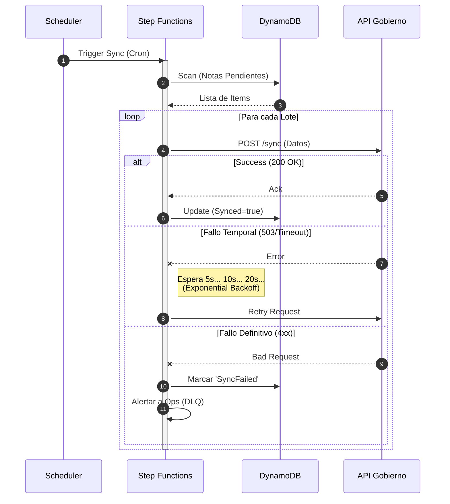

# Home Assessment: Architecture & Design Strategy

## 1. Principios de Diseño

Mi diseño busca ser pragmático. Estas son mis motivaciones para cada decisión:

* **Simplicidad Operativa:** Priorizo productos gestionados (Managed Services) en lugar de gestionar infraestructura propia. Evito Kubernetes o clusters de Kafka. Busco que los equipos se enfoquen en el producto, no en manejar infraestructura.
* **Serverless, donde haga sentido:** Uso Serverless (Lambda, SQS) para tráfico impredecible y masivo tratando de proteger costos. Uso contenedores en App Runner donde la latencia en *cold start* es crítica, evitando pagar *provisioned concurrency* en Lambda.
* **Developer Experience:** Busco reducir la complejidad mental del equipo (y la mía) separando ciertos dominios y evitando cadenas de Lambdas difíciles de monitorear, entre otros.
* **Resiliencia por diseño:** Siempre desarrollo pensando en que las piezas van a fallar.
* **Compliance y Seguridad:** La protección de datos (PII de menores) y el aislamiento entre escuelas (Multi-tenant) se manejan a nivel infraestructura e IAM. Es inaceptable que un tenant vea datos de otro.
* **Simplicidad:** Trato de no hacer sobre ingeniería, pero dejando margen para iteraciones cercanas.

## 2. Suposiciones (Key Assumptions)

Asumí y llené con mi imaginación educadamente bastantes gaps en la descripción del problema. Estas son algunas de las suposiciones que tomé:

* **Perfil de Tráfico:** Predecible pero explosivo. Se concentra de Lunes a Viernes de 7:00 a 12:00 hrs.
* **Volumen:** Por poner un número para dimensionar, definí "picos altos" como **~5,000 RPS** durante eventos masivos.
* **Latencia:** El requerimiento de **p95 < 120ms** implica que la lectura interactiva (ver perfil, dashboard) y el cálculo de notas deben ser en tiempo real. La ingesta de comportamiento puede ser de consistencia eventual.

## 3. Arquitectura de Contexto

Fronteras del sistema.

Descripción de Componentes y Flujos
A. Capa de Seguridad (Edge)
AWS WAF: Implementamos reglas de Rate Limiting por IP aquí para mitigar ataques DDoS antes de que toquen nuestra infraestructura de cómputo.

API Gateway: Gestiona la autenticación (JWT) y enruta el tráfico:

Tráfico interactivo -> App Runner.

Eventos de alta velocidad -> SQS (Integración directa).

B. Capa de Cómputo (Compute)
App Runner (Core Síncrono): Servicio de contenedores para lógica de negocio compleja (Cálculo de Notas). Mantiene conexiones calientes a la BD para latencia mínima.

SQS + Lambda Worker (Periferia Asíncrona):

SQS: Actúa como buffer "Anti-Stampede".

Lambda Worker: Consume mensajes en lotes (ej. 50 eventos) y realiza una sola escritura Batch a la base de datos, optimizando costos y conexiones.

Step Functions: Orquesta la sincronización con el Gobierno, manejando reintentos y esperas sin bloquear recursos.

C. Capa de Datos y Observabilidad
DynamoDB: Fuente de verdad única.

Pipeline de Analytics: Usamos EventBridge Pipes y Firehose para capturar todos los cambios en la BD (Streams) y archivarlos en S3 para auditoría y análisis, sin escribir código ETL manual.

Observabilidad:

CloudWatch: Centraliza logs estructurados (JSON).

X-Ray: Provee trazabilidad distribuida end-to-end usando el Trace-ID inyectado desde el API Gateway.

### El Estudiante (Ingesta Masiva / Anti-Stampede)
**Objetivo:** Absorber picos de ~5,000 RPS sin degradar la base de datos ni el servicio principal.
**Estrategia:** Desacoplamiento total usando el patrón *Queue-Based Load Leveling*.

### El Profesor (Core Interactivo / Baja Latencia)
Garantizar lectura y cálculo de notas en <120ms (p95).

Opté por App Runner (contenedores) en lugar de Lambda para este flujo específico.

Esto nos permite mantener en memoria caché las reglas de negocio y conexiones a base de datos persistentes (Keep-Alive), eliminando los Cold Starts y garantizando la estabilidad de la latencia para la experiencia de usuario crítica.

### Integración Gobierno
Objetivo: Manejar la inestabilidad de sistemas externos con reintentos robustos.

* Usamos Step Functions para manejar visualmente el estado de la transacción.
* Implementamos un patrón de Exponential Backoff (espera incremental) cuando el API del gobierno falla, evitando saturar su sistema y colapsar el nuestro.
* Cada intento y resultado queda auditado automáticamente por el historial de ejecución de la máquina de estados.