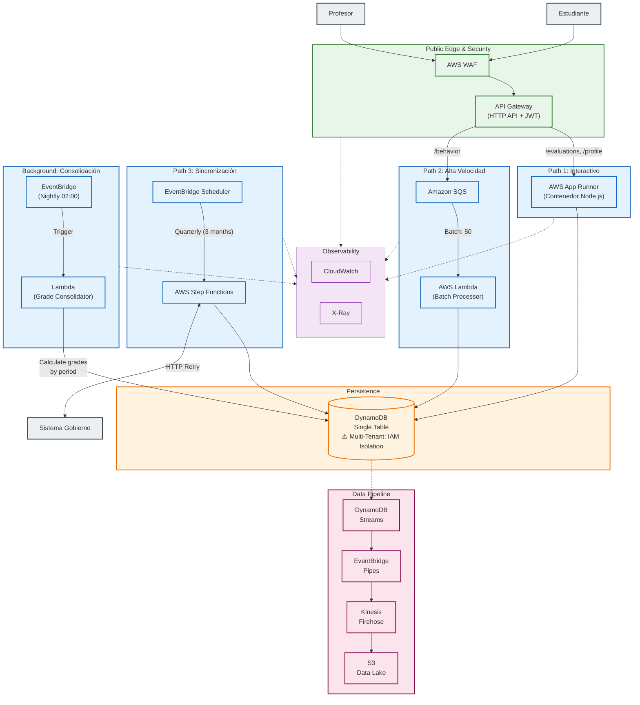
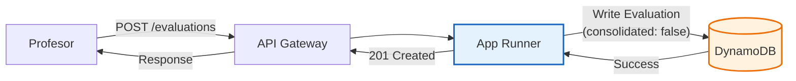
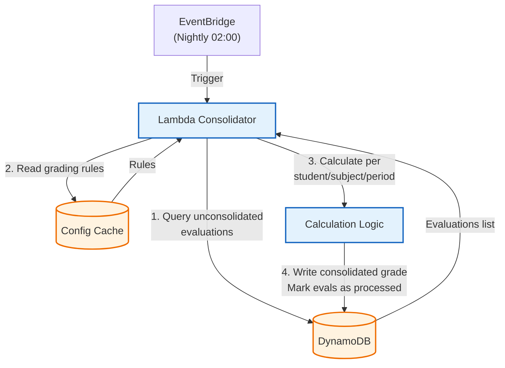
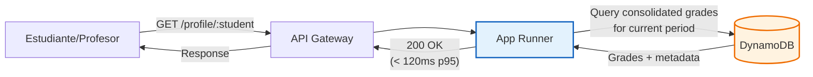
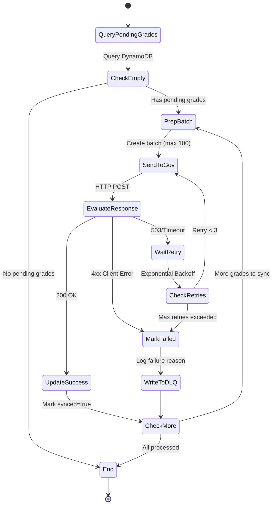
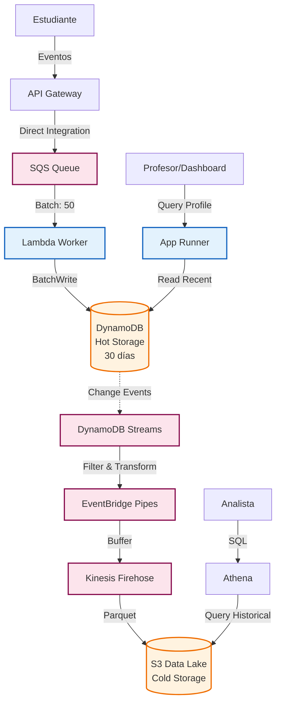

# Home Assessment: Architecture & Design Strategy

## 1. Principios de Diseño

Mi diseño busca ser pragmático. Estas son mis motivaciones para cada decisión:

* **Simplicidad Operativa:** Priorizo productos gestionados (Managed Services) en lugar de gestionar infraestructura propia. Evito Kubernetes o clusters de Kafka. Busco que los equipos se enfoquen en el producto, no en manejar infraestructura.
* **Serverless, donde haga sentido:** Uso Serverless (Lambda, SQS) para tráfico impredecible y masivo tratando de proteger costos. Uso contenedores en App Runner donde la latencia en *cold start* es crítica, evitando pagar *provisioned concurrency* en Lambda.
* **Developer Experience:** Busco reducir la complejidad mental del equipo (y la mía) separando ciertos dominios y evitando cadenas de Lambdas difíciles de monitorear, entre otros.
* **Resiliencia por diseño:** Siempre desarrollo pensando en que las piezas van a fallar.
* **Compliance y Seguridad:** La protección de datos (PII de menores) y el aislamiento entre escuelas (Multi-tenant) se manejan a nivel infraestructura e IAM. Es inaceptable que un tenant vea datos de otro.
* **Simplicidad:** Trato de no hacer sobre ingeniería, pero dejando margen para iteraciones cercanas.

## 2. Suposiciones (Key Assumptions)

Asumí y llené con mi imaginación educadamente bastantes gaps en la descripción del problema. Estas son algunas de las suposiciones que tomé:

* **Perfil de Tráfico:** Predecible pero explosivo. Se concentra de Lunes a Viernes de 7:00 a 12:00 hrs.
* **Volumen:** Por poner un número para dimensionar, definí "picos altos" como **~5,000 RPS** durante eventos masivos.
* **Latencia:** El requerimiento de **p95 < 120ms** implica que la lectura interactiva (ver perfil, dashboard) y el cálculo de notas deben ser en tiempo real. La ingesta de comportamiento puede ser de consistencia eventual.

## 3. Arquitectura del Sistema



### Estrategia de Separación de Dominios

Separé el sistema en **tres paths de ejecución** más un **background job** basándome en sus perfiles de tráfico y requerimientos de latencia:

**Path 1 (Interactivo):** Operaciones síncronas como consulta de perfiles y registro de evaluaciones individuales. Usé contenedores persistentes (App Runner) en lugar de funciones efímeras para mantener conexiones activas a la base de datos y configuraciones cargadas en memoria. Esto elimina cold starts y garantiza latencias estables bajo el target de p95 < 120ms. La lectura de perfiles consulta grades pre-calculados, no hace cálculos en tiempo real.

**Path 2 (Alta Velocidad):** Ingesta masiva de eventos de comportamiento estudiantil (~5,000 RPS en picos). API Gateway escribe directamente a SQS sin lambda intermedia, reduciendo costo y latencia. Lambda workers procesan en lotes de 50 mensajes, optimizando escrituras a DynamoDB mediante `BatchWriteItem`. La cola actúa como buffer anti-stampede protegiendo el resto del sistema.

**Path 3 (Sincronización):** Integración con el sistema del gobierno usando Step Functions para manejar la naturaleza inestable del API externo. La máquina de estados coordina reintentos con backoff exponencial, esperas largas sin consumir recursos, y mantiene auditoría completa del proceso de sincronización.

**Background Job (Consolidación):** Lambda corre nocturnamente (02:00 hrs) para calcular notas consolidadas por periodo académico. Aplica las reglas de consolidación configuradas por tenant sobre las evaluaciones individuales registradas durante el día. Esto desacopla la escritura rápida de evaluaciones del costo computacional de aplicar reglas complejas, garantizando que las consultas lean datos pre-calculados.

**Multi-Tenancy:** El aislamiento entre escuelas se garantiza a nivel IAM usando `dynamodb:LeadingKeys` en las políticas de acceso. Esto previene que un tenant acceda datos de otro incluso si existe un bug en la lógica de aplicación—crítico para compliance con datos de menores.

**Observabilidad:** CloudWatch centraliza logs estructurados (JSON) con correlation IDs que permiten seguir una transacción completa a través de todos los componentes. X-Ray provee trazabilidad distribuida para análisis de latencia y debugging.

**Data Pipeline:** DynamoDB Streams captura todos los cambios en la base de datos. EventBridge Pipes filtra y transforma los eventos antes de enviarlos a Kinesis Firehose, que los archiva en S3 en formato Parquet para auditoría y análisis posterior—sin escribir código ETL custom.

## 4. Casos de Uso Detallados

### 4.1 Notas Centralizadas

El sistema separa tres operaciones distintas: (1) registro de evaluaciones individuales, (2) cálculo de notas consolidadas por periodo, y (3) consulta de perfiles. La arquitectura refleja estos dominios con flujos independientes.

**Modelo de Datos:**

```
// Period Configuration (per tenant)
PK: TENANT#school_123#CONFIG
SK: PERIODS

Attributes:
- periods: [
    {"id": "Q1_2024", "start": "2024-01-15", "end": "2024-04-15"},
    {"id": "Q2_2024", "start": "2024-04-16", "end": "2024-07-15"}
  ]
- grading_rules: {
    "matematicas": {
      "weights": {"exam": 0.7, "homework": 0.2, "quiz": 0.1},
      "min_passing": 60
    }
  }
```

```
// Individual Evaluations (raw scores)
PK: TENANT#school_123#STUDENT#student_456
SK: EVAL#matematicas#Q1_2024#exam_001

Attributes:
- score: 85
- type: "exam"          // exam, quiz, homework
- date: "2024-02-15"
- teacher_id: teacher_789
- consolidated: false    // flag for background job
```

```
// Consolidated Grade (calculated by background job)
PK: TENANT#school_123#STUDENT#student_456
SK: GRADE#matematicas#Q1_2024

Attributes:
- consolidated_score: 84.3
- evaluations_count: 5
- last_calculated: timestamp
- version: 3
```

**Aislamiento Multi-Tenant:**

La seguridad entre escuelas se garantiza a nivel IAM, no solo en código. Cuando un profesor se autentica, recibe un JWT con claim `school_id`. App Runner asume un rol IAM dinámicamente con esta política:

```json
{
  "Effect": "Allow",
  "Action": ["dynamodb:GetItem", "dynamodb:PutItem", "dynamodb:Query"],
  "Resource": "arn:aws:dynamodb:*:table/luca-platform",
  "Condition": {
    "ForAllValues:StringLike": {
      "dynamodb:LeadingKeys": ["TENANT#${aws:PrincipalTag/school_id}#*"]
    }
  }
}
```

Esta política fuerza que **todas** las operaciones a DynamoDB solo puedan acceder items cuyo partition key empiece con `TENANT#school_123#`. Incluso si hay un bug en el código que olvida filtrar por tenant, AWS rechazará la query. Esto es crítico para compliance con datos de menores.

**Flujo 1: Registro de Evaluación**



**Flujo 2: Consolidación por Periodo (Background Job)**



**Flujo 3: Consulta de Perfil**



**Decisiones Clave:**

* **Separación de Escritura y Cálculo:** El profesor registra evaluaciones inmediatamente (write optimized), pero la consolidación corre en background. Esto desacopla la latencia de escritura del costo computacional de aplicar reglas complejas.

* **Background Job Nocturno:** Lambda corre a las 02:00 hrs cuando el tráfico es mínimo. Procesa todas las evaluaciones marcadas como `consolidated: false`, aplica las reglas del tenant, y escribe el grade consolidado. El flag `consolidated` previene reprocesamiento.

* **Configurabilidad por Periodo:** Cada tenant define sus periodos académicos (trimestres, semestres, bimestres) y las reglas de consolidación por materia. Cambiar de trimestres a semestres es solo actualizar el config item.

* **Latencia de Lectura:** Las consultas de perfil leen grades pre-calculados, garantizando p95 < 120ms. No hay cálculos en tiempo real durante la lectura.

### 4.2 Sincronización con Gobierno

La integración con el sistema del gobierno requiere resiliencia extrema dado que el API externo está fuera de nuestro control y puede ser inestable. El proceso corre cada 3 meses (trimestral) para enviar un corte de notas consolidadas. Step Functions coordina este proceso con manejo robusto de errores.

**Flujo de Sincronización:**



**Garantías del Sistema:**

* **Idempotencia:** Cada batch incluye `sync_batch_id` único como idempotency key. Si Step Functions reintenta un batch ya procesado, el API del gobierno puede detectar el duplicado y responder con éxito sin aplicar cambios dos veces.

* **Rate Limiting:** Configuré un `Wait` de 2 segundos entre batches para no saturar el sistema del gobierno. Si recibimos un `429 Too Many Requests`, el estado `WaitRetry` espera 30 segundos antes del siguiente intento.

* **Reintentos:** Hasta 3 intentos con backoff exponencial (5s, 15s, 45s). Solo para errores transitorios (5xx, timeouts). Los errores 4xx (bad request, unauthorized) fallan inmediatamente sin reintentar.

* **Dead Letter Queue:** Batches que fallan después de 3 reintentos se escriben a tabla `SyncFailures` en DynamoDB con metadata completa (timestamp, error, payload). Esto permite análisis posterior y reprocesamiento manual si es necesario.

* **Reconciliación:** Un Lambda separado corre diariamente consultando el API del gobierno para confirmar receipt de todos los batches enviados. Compara contra nuestra tabla de `synced=true` y genera alertas si detecta discrepancias.

### 4.3 Pipeline de Eventos de Comportamiento

El sistema debe construir perfiles de comportamiento estudiantil combinando señales en tiempo real (asistencia, participación) con análisis batch (tendencias semanales). La arquitectura separa ingesta rápida de procesamiento profundo.

**Arquitectura del Pipeline:**



**Flujo de Datos:**

Cuando un estudiante genera un evento (ej. completar una actividad, responder en clase), el evento llega a API Gateway y se escribe directamente a SQS. Lambda workers procesan los eventos en lotes de 50 y los escriben a DynamoDB como storage "caliente" para queries rápidos. 

Simultáneamente, DynamoDB Streams captura cada cambio y lo envía a EventBridge Pipes, que filtra eventos irrelevantes y transforma el formato. Kinesis Firehose recibe estos eventos, los agrupa en archivos Parquet, y los almacena en S3 como data lake "frío" para análisis histórico.

Para servir datos, App Runner consulta DynamoDB cuando un profesor ve el perfil del estudiante (latencia <100ms para actividad reciente). Para análisis de tendencias o reportes de cohortes, los analistas consultan S3 directamente via Athena usando SQL estándar.

**Estrategia de Datos:**

* **Hot Storage (DynamoDB):** Últimos 30 días de eventos raw. Diseñado para queries rápidos desde el perfil del estudiante (`PK: TENANT#school_id#STUDENT#student_id`, `SK: EVENT#timestamp`). TTL automático elimina eventos antiguos sin costo operativo.

* **Cold Storage (S3):** Historia completa en formato Parquet particionado por `year/month/school_id/`. Optimizado para análisis de cohortes y auditorías de compliance. Costo de almacenamiento ~$0.023/GB vs $0.25/GB en DynamoDB.

* **Serving:** App Runner lee de DynamoDB para mostrar "actividad reciente" (<100ms). Para análisis históricos, analistas consultan S3 via Athena con queries SQL estándar.

**Privacidad y Explicabilidad:**

* **Pseudonimización:** En el data lake, `student_id` se hashea con salt por tenant antes de escribir a S3. Los analistas ven patrones agregados sin identificar estudiantes individuales.

* **Retención:** Eventos eliminados automáticamente 2 años después de graduación del estudiante (configurado via S3 Lifecycle Policy).

* **Explicabilidad:** El perfil del estudiante muestra: "5 participaciones esta semana" con drill-down opcional mostrando timestamps específicos. Los profesores ven qué eventos contribuyeron al score, no solo un número opaco.

## 5. Decisiones Clave

Estas son las decisiones arquitectónicas más importantes y las alternativas que descarté:

### **Computación Híbrida: App Runner + Lambda**
* **Elegí:** Contenedores persistentes (App Runner) para core + Lambda para ingesta asíncrona
* **En lugar de:** Full Serverless (solo Lambda) o Full Containers (ECS/Fargate everywhere)
* **Por qué:** Lambda con provisioned concurrency para el core habría costado ~$200/mes adicionales solo para evitar cold starts. App Runner escala a cero cuando no hay tráfico pero mantiene 1 instancia caliente durante horas escolares. Lambda es perfecto para la ingesta donde el cold start es irrelevante (procesamiento batch) y el modelo de pricing por invocación optimiza costos con tráfico spiky.

### **DynamoDB Single Table vs PostgreSQL**
* **Elegí:** DynamoDB On-Demand con diseño single table
* **En lugar de:** RDS PostgreSQL o Aurora Serverless
* **Por qué:** El modelo de datos es document-oriented (perfiles con atributos configurables por tenant) sin necesidad de JOINs complejos. DynamoDB On-Demand elimina capacity planning y escala automáticamente durante picos sin warm-up. El trade-off: perdemos transacciones ACID multi-item, pero esto es aceptable dado que cada operación es atómica dentro de un tenant. Para queries analíticos complejos, tenemos el data lake en S3.

### **Multi-Tenant: IAM Enforcement**
* **Elegí:** Políticas IAM con `dynamodb:LeadingKeys` para forzar aislamiento a nivel infraestructura
* **En lugar de:** Filtrado solo a nivel aplicación (WHERE tenant_id = X)
* **Por qué:** Compliance. Con datos de menores, no puedo permitir que un bug en el código exponga datos cross-tenant. IAM enforcement significa que incluso si un desarrollador olvida el filtro WHERE, AWS rechazará la query. El costo: mayor complejidad en el esquema de autenticación y need de asumir roles dinámicamente.

### **Step Functions vs Custom Retry Logic**
* **Elegí:** Step Functions para orquestar sincronización con gobierno
* **En lugar de:** Lambda con custom retry logic + DynamoDB para state tracking
* **Por qué:** Implementar exponential backoff, timeouts, y circuit breakers en código es error-prone. Step Functions mantiene el estado de forma durable, permite esperas de hasta 1 año sin consumir recursos, y provee auditoría visual del flujo. El costo adicional (~$25/1M transitions) es despreciable comparado con el costo de debugging failed syncs en producción.

### **EventBridge Pipes vs Lambda Glue**
* **Elegí:** EventBridge Pipes para conectar DynamoDB Streams → Firehose
* **En lugar de:** Lambda function leyendo el stream y escribiendo a Firehose
* **Por qué:** Zero code. Pipes maneja el polling, batching, retries, y error handling. Reducción de superficie de ataque (menos código custom = menos bugs). El único trade-off: menos flexibilidad para transformaciones complejas, pero nuestro caso (filtrar + formatear a Parquet) cae perfectamente en el sweet spot de Pipes.