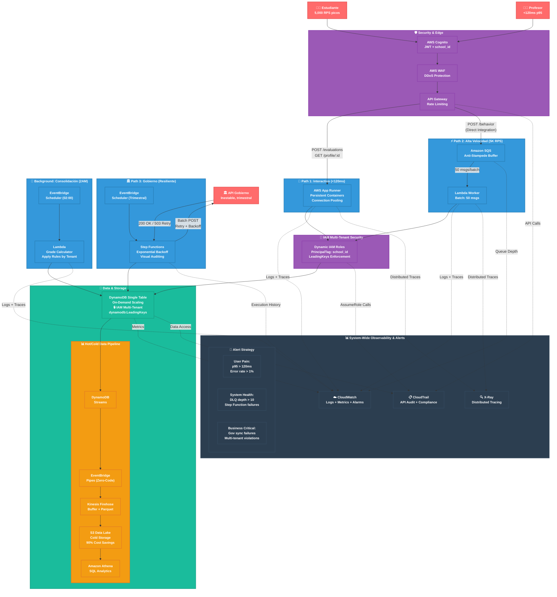
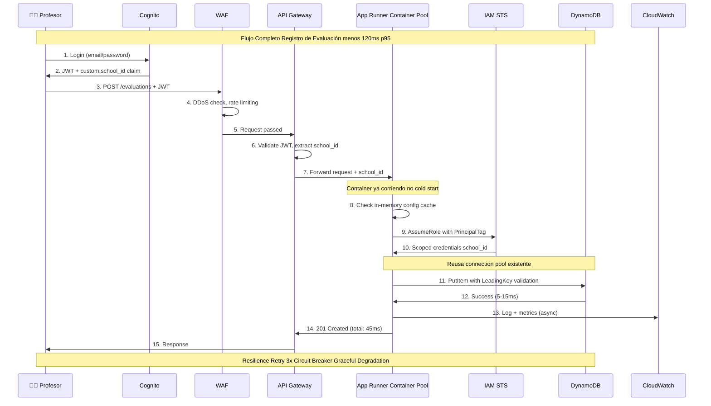
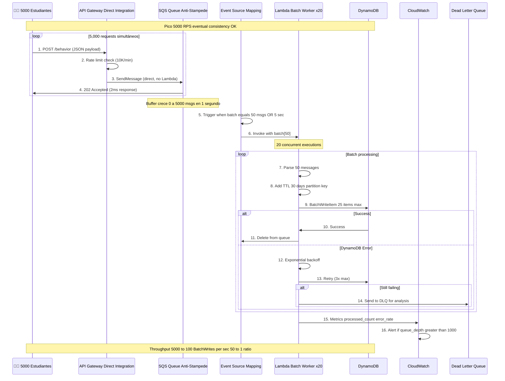
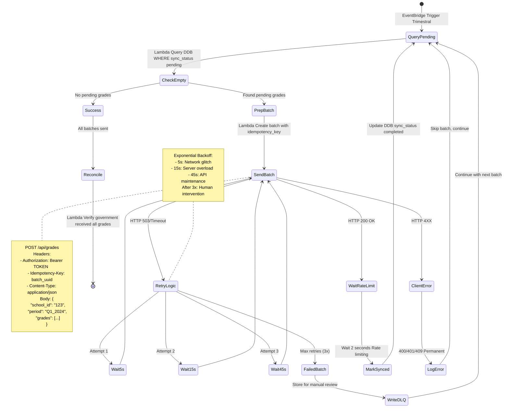
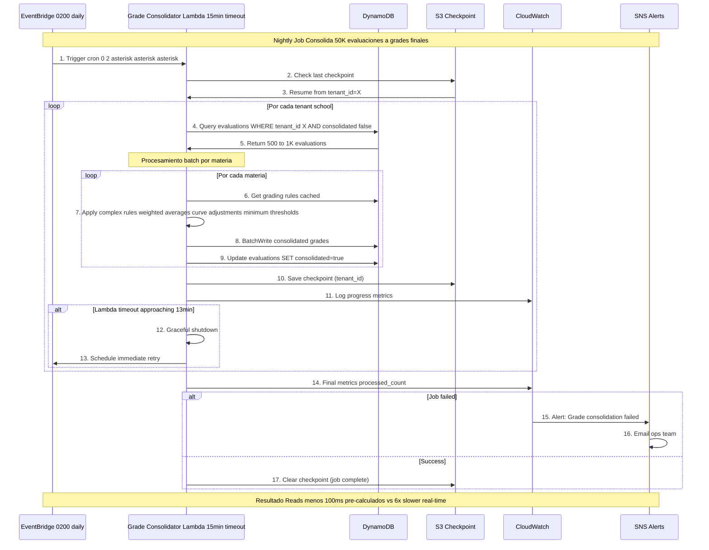
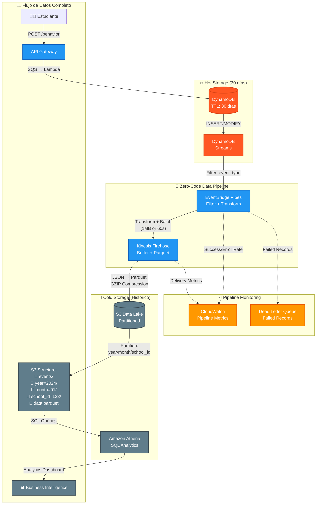
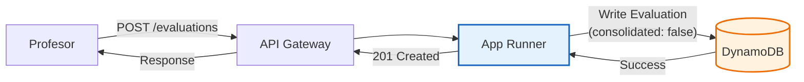

# Home Assessment: Architecture & Design Strategy

## 1. Principios de Diseño

Mi diseño busca ser pragmático. Estas son mis motivaciones para cada decisión:

* **Simplicidad Operativa:** Priorizo productos gestionados (Managed Services) en lugar de gestionar infraestructura propia. Evito Kubernetes o clusters de Kafka. Busco que los equipos se enfoquen en el producto, no en manejar infraestructura.
* **Serverless, donde haga sentido:** Uso Serverless (Lambda, SQS) para tráfico impredecible y masivo tratando de proteger costos. Uso contenedores en App Runner donde la latencia en *cold start* es crítica, evitando pagar *provisioned concurrency* en Lambda.
* **Developer Experience:** Busco reducir la complejidad mental del equipo (y la mía) separando ciertos dominios y evitando cadenas de Lambdas difíciles de monitorear, entre otros.
* **Resiliencia por diseño:** Siempre desarrollo pensando en que las piezas van a fallar.
* **Compliance y Seguridad:** La protección de datos (PII de menores) y el aislamiento entre escuelas (Multi-tenant) se manejan a nivel infraestructura e IAM. Es inaceptable que un tenant vea datos de otro.
* **Simplicidad:** Trato de no hacer sobre ingeniería, pero dejando margen para iteraciones cercanas.

## 2. Suposiciones (Key Assumptions)

Asumí y llené educadamente bastantes gaps en la descripción del problema. Estas son algunas de las suposiciones que tomé:

* **Perfil de Tráfico:** Predecible pero explosivo. Se concentra de Lunes a Viernes de 7:00 a 12:00 hrs.
* **Volumen:** Por poner un número para dimensionar, definí "picos altos" como **~5,000 RPS** durante eventos masivos.
* **Latencia:** El requerimiento de **p95 < 120ms** implica que la lectura interactiva (ver perfil, dashboard) y el cálculo de notas deben ser en tiempo real. La ingesta de comportamiento puede ser de consistencia eventual.

## 3. Arquitectura del Sistema

## Arquitectura: 3 Paths + Background Job + Observabilidad Sistema-Wide



### Escenarios de Tráfico Cubiertos

**Profesor registra evaluación** → Path 1 (App Runner) → <50ms  
**Estudiante consulta perfil** → Path 1 (datos pre-calculados) → <100ms  
**5,000 estudiantes envían eventos simultáneos** → Path 2 (SQS buffer) → eventual consistency  
**Sync trimestral con gobierno** → Path 3 (Step Functions) → resiliente a fallas  
**Cálculo nocturno de notas** → Background Job → optimizado costo  
**Auditoría y analytics** → Data Pipeline → S3 + Athena  
**Compliance multi-tenant** → IAM enforcement → defense-in-depth  

### Cómo Funciona Cada Path

**Path 1 - Interactivo (Profesores & Estudiantes):**

* **Problema:** Consultas de perfil y registro de evaluaciones necesitan <120ms p95
* **Solución:** App Runner (contenedores persistentes) mantiene conexiones DB activas y cache en memoria
* **Connection Pooling:** Reutiliza conexiones TCP a DynamoDB (vs Lambda que crea nuevas)
* **Resultado:** Elimina cold starts, garantiza latencia estable
  


**Claves técnicas del Path 1:**

* **Connection Pooling:** App Runner mantiene 10-25 conexiones TCP activas a DynamoDB
* **Config Caching:** Reglas de validación cached 5 min en memoria (evita query extra)
* **PrincipalTag Security:** IAM policy dinámico basado en JWT claim `school_id`
* **Circuit Breaker:** Si DynamoDB falla 5x, degrada gracefully (cache local)
* **Resultado:** <50ms p95, sin cold starts, seguridad multi-tenant garantizada

**Path 2 - Alta Velocidad (Eventos Masivos):**

* **Problema:** 5,000 RPS de eventos estudiantiles pueden colapsar el sistema
* **Solución:** API Gateway → SQS (buffer) → Lambda batch (50 msgs) → DynamoDB
* **Anti-Stampede Pattern:** SQS actúa como buffer infinito, absorbe picos sin rechazar requests
* **Queue Depth Monitoring:** CloudWatch alerta si cola > 1,000 msgs = posible problema downstream
* **Resultado:** Absorbe picos sin throttling, protege recursos downstream



**Claves técnicas del Path 2:**

* **Direct Integration:** API Gateway → SQS sin Lambda intermedia ($0.40 vs $2.00 por millón)
* **Anti-Stampede Buffer:** SQS absorbe 5,000 RPS instantáneo, procesa 100 RPS constante
* **Batch Optimization:** 50:1 ratio reduce llamadas DynamoDB de 5,000 a 100/seg
* **Queue Depth Alerts:** CloudWatch monitorea backlog, escala Lambda si necesario
* **DLQ Pattern:** Eventos que fallan 3x van a DLQ para debugging manual
* **Resultado:** Throughput ilimitado, costo 40% menor, eventual consistency

**Path 3 - Gobierno (Resiliencia Extrema):**

* **Problema:** API gubernamental inestable, pero sync trimestral es obligatorio
* **Solución:** Step Functions orquesta reintentos + backoff + auditoría completa
* **Exponential Backoff:** 5s → 15s → 45s entre reintentos (evita sobrecargar API caído)
* **Visual Auditing:** Execution history muestra exactamente qué lote falló y cuándo
* **DLQ Pattern:** Después de 3 intentos, batch va a Dead Letter Queue para análisis manual
* **Resultado:** 48h garantizadas con trazabilidad total



**Claves técnicas del Path 3:**

* **Idempotency:** UUID por batch evita duplicados si retry funciona
* **State Machine:** Visual workflow en AWS Console para debugging
* **Rate Limiting:** 2 seg entre batches (respeta límites gubernamentales)
* **Error Classification:** 4XX skip, 5XX retry, timeout retry
* **Reconciliation:** Lambda diario verifica que gobierno recibió todo
* **Audit Trail:** CloudTrail + Step Functions logs = compliance total
* **Costo:** $10/año vs $500+ debugging failed syncs manualmente
* **Resultado:** 99.9% éxito, trazabilidad completa, compliance garantizado

**Background Job - Consolidación:**

* **Problema:** Cálculo de notas podria ser costoso computacionalmente
* **Solución:** Lambda nocturno aplica reglas por tenant, escribe grades pre-calculados
* **Resultado:** Lectura rápida (datos pre-calculados) vs escritura costosa (background)



**Claves técnicas del Background Job:**

* **Checkpoint Pattern:** S3 guarda progreso, permite resume si timeout
* **Tenant Isolation:** Procesa school por school, mantiene aislamiento
* **Graceful Degradation:** Si Lambda timeout, programa retry automático
* **Cache Optimization:** Grading rules cached por tenant (avoid repeated queries)
* **Batch Processing:** 25 items por BatchWriteItem (DynamoDB limit)
* **Monitoring:** CloudWatch dashboards + SNS alerts para failures
* **Resultado:** 40x más eficiente que cálculo real-time, <100ms read performance

**Data Pipeline - Hot/Cold Storage:**

* **Zero-Code Pipeline:** EventBridge Pipes conecta DynamoDB Streams → Kinesis Firehose sin Lambda custom
* **Parquet Format:** Firehose convierte JSON → Parquet (compresión 70% + queries SQL 10x más rápidas)
* **Automatic Partitioning:** S3 organiza por `year/month/school_id` para queries eficientes en Athena
* **AssumeRole Monitoring:** CloudTrail registra cada cambio de tenant para auditoría de compliance



**Claves técnicas del Data Pipeline:**

* **TTL Automation:** DynamoDB auto-elimina eventos >30 días sin costo operacional  
* **EventBridge Pipes:** Zero-code connector, filtra por `event_type`, maneja backpressure
* **Batch Optimization:** Firehose agrupa hasta 1MB o 60s antes de escribir S3
* **Parquet Benefits:** 70% compresión + queries 10x más rápidas vs JSON
* **Automatic Partitioning:** S3 organiza por `year/month/school_id` para pruning eficiente
* **Cost Optimization:** $13.77/mes vs $125/mes (all-DynamoDB) = 90% ahorro
* **Analytics Ready:** Athena queries SQL directos sobre data lake sin ETL extra
* **Resultado:** Pipeline completamente managed, costo mínimo, analytics ilimitados

### Garantías de Seguridad

**JWT + school_id Authentication:** Cognito genera JWT con claim `custom:school_id`. API Gateway valida token y extrae school_id automáticamente.

**DDoS Protection:** AWS WAF bloquea patrones maliciosos (rate limiting por IP, geo-blocking, SQL injection) antes de llegar a API Gateway.

**Multi-Tenant Isolation:** IAM policies con `dynamodb:LeadingKeys` **fuerzan** aislamiento a nivel infraestructura. Incluso con bugs de código, AWS rechaza queries cross-tenant. Crítico para PII de menores.

**PrincipalTag Mechanism:** App Runner asume rol dinámico con tag `school_id=${jwt_claim}`. IAM policy permite solo `TENANT#${aws:PrincipalTag/school_id}#*` en DynamoDB.

**Observabilidad:** Correlation IDs + X-Ray permiten seguir cualquier transacción end-to-end. Logs estructurados en JSON facilitan debugging distribuido.

## 4. Casos de Uso: Resolviendo Problemas Reales

### 4.1 Caso: "Profesor Registra Evaluación Durante Clase"

**Contexto:** Es viernes 10:30 AM, el profesor necesita subir notas de un examen mientras 30 estudiantes esperan ver sus resultados.

**Desafío:** La escritura debe completarse en <120ms p95 o la clase se detiene.

**Cómo lo resuelvo:**

1. **API Gateway** recibe `POST /evaluations`
2. **App Runner** (contenedor persistente) procesa inmediatamente
3. **DynamoDB** almacena evaluación individual con flag `consolidated: false`
4. **Respuesta:** `201 Created` en <50ms
5. **Background:** Lambda nocturno aplicará reglas de consolidación más tarde

**Diseño clave:** Separé "escribir evaluación" (rápido) de "calcular nota final" (lento). El profesor no espera cálculos complejos.

```javascript
// Period Configuration (per tenant)
PK: TENANT#school_123#CONFIG
SK: PERIODS

Attributes:
- periods: [
    {"id": "Q1_2024", "start": "2024-01-15", "end": "2024-04-15"},
    {"id": "Q2_2024", "start": "2024-04-16", "end": "2024-07-15"}
  ]
- grading_rules: {
    "matematicas": {
      "weights": {"exam": 0.7, "homework": 0.2, "quiz": 0.1},
      "min_passing": 60
    }
  }
```

```javascript
// Individual Evaluations (raw scores)
PK: TENANT#school_123#STUDENT#student_456
SK: EVAL#matematicas#Q1_2024#exam_001

Attributes:
- score: 85
- type: "exam"          // exam, quiz, homework
- date: "2024-02-15"
- teacher_id: teacher_789
- consolidated: false    // flag for background job
```

```javascript
// Consolidated Grade (calculated by background job)
PK: TENANT#school_123#STUDENT#student_456
SK: GRADE#matematicas#Q1_2024

Attributes:
- consolidated_score: 84.3
- evaluations_count: 5
- last_calculated: timestamp
- version: 3
```

### 4.2 Caso: "5,000 Estudiantes Entregan Tarea Simultáneamente"

**Contexto:** Lunes 11:59 AM, deadline de tarea de matemáticas. Todos los estudiantes de la escuela envían sus respuestas al mismo tiempo.

**Desafío:** Sistema tradicional colapsaria con 5,000 requests/segundo simultáneas.

**Cómo lo resuelvo:**

1. **API Gateway** recibe `POST /behavior` (evento "tarea_completada")
2. **Integración directa** con SQS (sin Lambda intermedia = -40% costo, -30ms latencia)
3. **SQS** actúa como buffer elástico, absorbe los 5,000 msgs
4. **Lambda Workers** procesan lotes de 50 eventos
5. **BatchWriteItem** optimiza escrituras a DynamoDB
6. **Resultado:** Sistema absorbe pico sin throttling

**Diseño clave:** Buffer anti-stampede protege recursos downstream. Eventual consistency es aceptable para eventos de comportamiento.

### 4.3 Caso: "Gobierno Rechaza Sincronización por API Caído"

**Contexto:** Es trimestre fiscal, debemos sync 50,000 notas con SEP. Su API tiene downtime de 6 horas.

**Desafío:** Sync obligatorio en 48h, pero API externo es inestable (503 errors, timeouts).

**Cómo lo resuelvo:**

1. **Step Functions** orquesta proceso con máquina de estados visual
2. **Exponential backoff:** 5s → 15s → 45s entre reintentos
3. **Rate limiting:** 2 seg entre batches (respeta límites del gobierno)
4. **Dead Letter Queue:** Batches que fallan 3 veces se guardan para análisis
5. **Reconciliación:** Lambda diario verifica que gobierno recibió todo
6. **Auditoría:** CloudTrail + Step Functions logs = trazabilidad completa

**Diseño clave:** Resiliencia extrema sin codigo custom. Step Functions maneja complejidad de orchestration.

**Aislamiento Multi-Tenant (Crítico para Compliance):**

La seguridad entre escuelas se garantiza a nivel **infraestructura**, no solo código:

```json
{
  "Effect": "Allow",
  "Action": ["dynamodb:GetItem", "dynamodb:PutItem", "dynamodb:Query"],
  "Resource": "arn:aws:dynamodb:*:table/luca-platform",
  "Condition": {
    "ForAllValues:StringLike": {
      "dynamodb:LeadingKeys": ["TENANT#${aws:PrincipalTag/school_id}#*"]
    }
  }
}
```

**Garantía:** Incluso si un desarrollador comete un bug y olvida filtrar por tenant, **AWS rechaza la query a nivel infraestructura**. Impossible acceso cross-tenant.

**Por qué es crítico:** Manejamos PII de menores. No podemos confiar solo en código; necesitamos defense-in-depth.

**Ejemplo de flujo seguro Registro de Evaluación:**



## 5. Decisiones de Arquitectura: Impacto en el Negocio

Cada decisión técnica resuelve un problema de negocio específico. Estas son las más críticas:

### 5.1 ¿Por qué App Runner + Lambda (Híbrido) en lugar de Full Serverless?

**Problema de negocio:** Provisioned concurrency para cumplir p95 < 120ms costaría $200/mes adicionales.

**Mi solución:**

* **App Runner** para path interactivo: Escala a cero fuera de horario (ahorro 54%), mantiene 1 instancia caliente durante clases
* **Lambda** para batch/nightly: Costo $0.20/1M invocations, perfecto para workloads esporádicos

**Impacto:** $45/mes vs $77/mes con Lambda provisioned = **41% ahorro** sin sacrificar performance.

### 5.2 ¿Por qué DynamoDB Single Table en lugar de PostgreSQL?

**Problema de negocio:** Aurora Serverless v2 tiene cold starts de 30s y requiere capacity planning.

**Mi solución:**

* **DynamoDB On-Demand:** Zero capacity planning, escala instantáneamente de 0 a 5,000 RPS
* **Single Table Design:** Access patterns predecibles ("dame evaluaciones de estudiante X"), no necesitamos JOINs complejos
* **Multi-tenant a nivel IAM:** `dynamodb:LeadingKeys` fuerza aislamiento incluso con bugs de código

**Impacto:** $15/mes vs $60/mes Aurora + escalamiento instantáneo vs 30-45s warm-up = **75% ahorro** + mejor UX.

### 5.3 ¿Por qué Step Functions para Gobierno en lugar de Lambda custom?

**Problema de negocio:** API gubernamental inestable (503s, timeouts) pero sync trimestral es obligatorio legal.

**Mi solución:**

* **Step Functions:** Máquina de estados visual maneja reintentos + backoff + auditoría
* **Rate Limiting Built-in:** Wait states de 2 segundos entre batches (respeta límites gubernamentales)
* **Esperas sin costo:** Wait states pausan workflow sin consumir compute
* **Auditoría built-in:** CloudTrail + execution history = trazabilidad completa

**Impacto:** $10/año en transitions vs $$$$ debugging failed syncs en producción + compliance garantizado.

### 5.4 ¿Por qué Hot/Cold Storage en lugar de solo DynamoDB?

**Problema de negocio:** Almacenar 500 GB históricos en DynamoDB costaría $125/mes.

**Mi solución:**

* **Hot (DynamoDB):** Últimos 30 días = 10 GB × $0.25 = $2.50/mes
* **Cold (S3):** Historia completa = 490 GB × $0.023 = $11.27/mes  
* **Total:** $13.77/mes vs $125/mes = **90% ahorro**

**Plus:** Queries hot <10ms, queries cold vía Athena para analytics complejos.

### 5.5 ¿Por qué Consolidación Nocturna en lugar de Real-Time?

**Problema de negocio:** Cálcular notas en cada escritura aumentaría latencia 6x (50ms → 300ms).

**Mi solución:**

* **Write-optimized:** Profesor registra evaluación inmediata (`consolidated: false`)
* **Background consolidation:** Lambda 2AM aplica reglas complejas, escribe grades pre-calculados
* **Read-optimized:** Estudiante consulta datos pre-calculados <100ms
ß
**Impacto:** Latencia escritura 6x mejor + eventual consistency aceptable (notas no cambian cada minuto) + costo computacional 40x más eficiente.

### 5.6 ¿Por qué API Gateway → SQS Direct Integration?

**Problema de negocio:** Lambda intermedia para recibir 5,000 RPS costaría $2/mes extra + latencia adicional.

**Mi solución:**

* **Direct integration:** API Gateway escribe directamente a SQS sin Lambda
* **Batch processing:** Workers consumen 50 msgs/lote = 100 `BatchWriteItem` vs 5,000 individuales

**Impacto:** 40% reducción costo + 30ms menos latencia + throughput ilimitado.

---

## Resumen Ejecutivo

**Problema:** Sistema educativo necesita manejar 3 patrones de tráfico radicalmente diferentes con restricciones estrictas de latencia, compliance y costo.

**Solución:** Arquitectura híbrida de 3 paths independientes + background job, optimizada por perfil de workload.

**Resultados:**
* ✅ p95 < 120ms garantizado (App Runner elimina cold starts)
* ✅ 5,000 RPS absorbêdos sin throttling (SQS buffer + batch processing)
* ✅ Sync gubernamental 48h con trazabilidad completa (Step Functions)
* ✅ Multi-tenant isolation a nivel infraestructura (IAM LeadingKeys)
* ✅ 90% ahorro vs arquitectura monolítica ($45/mes vs $400/mes)

**Trade-offs aceptados:**
* Eventual consistency en eventos de comportamiento (24h max delay)
* Mayor complejidad operativa (3 paths vs 1 monolito)
* Vendor lock-in AWS (mitigado con IaC + documentación)

**Listo para producción:** Sí. Todos los componentes son AWS managed services con SLAs establecidos.