# Sistema de Evaluaciones Educativas - Diseño de Arquitectura

## Principios de Diseño

Mi diseño busca ser pragmático. Estas son mis motivaciones para cada decisión:

- **Simplicidad Operativa:** Priorizo productos gestionados (Managed Services) en lugar de gestionar infraestructura propia. Evito Kubernetes o clusters de Kafka. Busco que los equipos se enfoquen en el producto, no en manejar infraestructura.
- **Serverless, donde haga sentido:** Uso Serverless (Lambda, SQS) para tráfico impredecible y masivo tratando de proteger costos. Uso contenedores en App Runner donde la latencia en *cold start* es crítica, evitando pagar *provisioned concurrency* en Lambda.
- **Developer Experience:** Busco reducir la complejidad mental del equipo (y la mía) separando ciertos dominios y evitando cadenas de Lambdas difíciles de monitorear, entre otros.
- **Resiliencia por diseño:** Siempre desarrollo pensando en que las piezas van a fallar.
- **Compliance y Seguridad:** La protección de datos (PII de menores) y el aislamiento entre escuelas ß(Multi-tenant) se manejan a nivel infraestructura e IAM. Es inaceptable que un tenant vea datos de otro.
- **Simplicidad:** Trato de no hacer sobre ingeniería, pero dejando margen para iteraciones cercanas.

**Assumptions clave:**
- **Usuarios:** 50 escuelas, ~5k estudiantes, horario escolar concentrado (8am-4pm)
- **Patrones:** Escritura batch nocturna, lecturas concentradas durante clases
- **Compliance:** PII de menores, retención 3 años, auditoría gobierno
- **API Gobierno:** Inestable, rate-limited, timeout frecuente

## El Problema

Tres flujos críticos con restricciones específicas:

1. **Evaluaciones centralizadas** - p95 < 120ms durante horario escolar
2. **Sincronización trimestral** - API gubernamental inestable, 48h compliance deadline, trazabilidad total
3. **Perfil comportamental** - Picos 5k RPS, analytics histórico
**Restricción clave:** Multi-tenant strict con auditoría real, sin fugas entre tenants.
## Arquitectura AWS - Vista Completa

## Escenarios de Uso

Cada escenario demuestra las decisiones clave de latencia, seguridad, y operación:

### Escenario 1: Profesora registra evaluación (11:30am, clase activa)

**Flujo write crítico** - debe completar en <120ms para no interrumpir clase.

```mermaid
flowchart LR
    Prof[👩‍🏫 Profesora] -->|JWT school_id=123| WAF[WAF]
    WAF -->|DDoS + Rate Check| APIG[API Gateway]
    APIG -->|Validate JWT| AppRunner[App Runner<br/>Container Pool]
    AppRunner -->|Cached Config<br/>TCP Pool| DDB[(DynamoDB)]
    DDB -->|PutItem 15ms| AppRunner
    AppRunner -->|201 Created 45ms| Prof
    
    AppRunner -.->|Async| CW[CloudWatch]
    CW -.->|Alert if p95 > 120ms| SNS[SNS]
```

**Decisiones de latencia/escala:**
- **Connection pooling:** App Runner mantiene 10-25 TCP connections a DynamoDB (vs Lambda cold start)
- **Config caching:** Validation rules cached 5min in-memory, evita query extra
- **Read models:** Consolidated grades pre-calculados nocturnamente

**Multi-tenant security:**
- **IAM enforcement:** `dynamodb:LeadingKeys` policy fuerza PK = `school_id` del JWT
- **PII protection:** DynamoDB encryption at-rest + CloudTrail audit de cada write

**Monitoring completo:**
- **App Runner** → **CloudWatch Logs** (structured logging con correlation ID)
- **CloudWatch Metrics** → custom metric `EvaluationLatency` p95
- **CloudWatch Alarm** → si p95 > 120ms por 2 minutos consecutivos
- **SNS Topic** → email/SMS a equipo DevOps para scaling manual
- **Auto-scaling trigger** → App Runner scales 1→3 instancias automáticamente

**Trade-off:** App Runner vs ECS Fargate → menos config, auto-scaling built-in

---

### Escenario 2: 5,000 estudiantes envían eventos simultáneos (recreo)

**Flujo anti-stampede** - absorber pico sin rechazar requests ni colapsar downstream.

```mermaid
flowchart TD
    Students[👨‍🎓 5k Estudiantes] -->|POST /behavior| APIG2[API Gateway<br/>Direct Integration]
    APIG2 -->|SendMessage<br/>No Lambda| SQS[SQS Queue<br/>Anti-Stampede]
    SQS -->|202 Accepted<br/>2ms| Students
    
    SQS -->|Batch 50 msgs<br/>or 5 sec| ESM[Event Source<br/>Mapping]
    ESM -->|20 concurrent| Lambda[Lambda Workers]
    Lambda -->|BatchWrite 25| DDB[(DynamoDB)]
    
    Lambda -.->|Failed 3x| DLQ[Dead Letter<br/>Queue]
    Lambda -.->|Metrics| CW[CloudWatch]
    CW -.->|Queue depth > 1K| SNS[Alert]
```

**Decisiones de latencia/escala:**
- **Anti-stampede:** SQS actúa como buffer infinito, absorbe 5k → 100 RPS steady
- **Batch optimization:** 50:1 ratio reduce DynamoDB calls, $0.40 vs $2.00 por millón
- **Event-driven:** No polling, ESM trigger automático

**Operación completa:**
- **SQS CloudWatch Metric:** `ApproximateNumberOfVisibleMessages` (queue depth)
- **Queue depth > 1000** significa: Lambda workers no procesan tan rápido como llegan eventos
- **CloudWatch Alarm:** `QueueDepthHigh` activo si depth > 1000 por 5 minutos
- **SNS notification:** Alerta a equipo para investigar bottleneck downstream
- **Posibles causas:** DynamoDB throttling, Lambda timeout, network issues
- **DLQ pattern:** Eventos que fallan 3x van a DLQ para debugging manual
- **Auto-scaling:** Lambda concurrency escala automático hasta 20 concurrent executions

**Trade-off:** Eventual consistency (OK para behavior events) vs real-time complexity

---

### Escenario 3: Sync trimestral con gobierno (API inestable)

**Flujo de máxima resiliencia** - debe completar en 48h con trazabilidad total.

**Integración gobierno (todos los requisitos de Jesús):**
- **Idempotencia:** Batch UUID como header, API acepta duplicados safely
- **Rate limiting:** Max 2 requests/segundo para no sobrecargar API externo
- **Reintentos:** Exponential backoff 5s → 15s → 45s (network glitch → server overload → maintenance)
- **Reconciliación:** Lambda final verifica que gobierno recibió todos los grades vs base local
- **Auditoría:** Step Functions execution history + CloudTrail = trazabilidad completa

**Operación (Step Functions son visibles en AWS Console):**
- **Visual debugging:** AWS Step Functions Console → Execution History tab muestra exactamente qué batch falló y cuándo
- **State machine definition:** JSON visible en Definition tab, editable via Code/Visual editor
- **Real-time execution:** Graph view muestra progreso actual: QueryPending → SendBatch → Retry5s, etc.
- **Manual intervention:** DLQ + SNS alert para casos que requieren revisión humana
- **Compliance:** 48h deadline met con retry automático + manual fallback

**Trade-off:** Step Functions vs Lambda custom → state management declarativo, timeouts largos

---

### Escenario 4: Pipeline de datos para analytics

**Flujo hot/cold storage** - optimizar costo vs query performance.

```mermaid
flowchart LR
    DDB[(DynamoDB<br/>Hot 30 días)] -->|Streams| Pipes[EventBridge<br/>Pipes]
    Pipes -->|Filter + Transform| Firehose[Kinesis<br/>Firehose]
    Firehose -->|Parquet + GZIP<br/>1MB batches| S3[(S3 Data Lake<br/>Cold Storage)]
    S3 -->|Partitioned by<br/>year/month/school| Athena[Athena<br/>Analytics]
    
    Pipes -.->|Failed records| DLQ2[DLQ]
    Firehose -.->|Delivery metrics| CW2[CloudWatch]
```

**Decisiones de latencia/escala:**
- **Hot/cold separation:** DynamoDB TTL 30 días, S3 histórico = 90% cost reduction
- **Zero-code pipeline:** EventBridge Pipes + Firehose, no Lambda custom
- **Query optimization:** Parquet format + partitioning = 10x faster Athena queries

**Multi-tenant security:**
- **Data isolation:** S3 partitioned by school_id, IAM policies enforce access
- **Retention:** TTL automático en hot data, cold data retained 3 años compliance

**Trade-off:** All DynamoDB vs Hot/Cold → operational complexity pero massive cost savings

---

## Trade-offs por Componente

### **Arquitectura General**
- **Híbrido compute vs uniformidad:** App Runner elimina cold starts para path interactivo (<120ms), Lambda para batch. Todo Lambda requeriría $200/mes provisioned concurrency.

### **Base de Datos**  
- **DynamoDB single table vs PostgreSQL:** Sacrifico JOINs nativos pero gano 10-15ms menos latency + escalamiento instantáneo. Aurora toma 30-45s en escalar durante picos.
- **On-demand vs provisioned:** Pago por uso real vs capacity planning. Tráfico educativo es spiky (8am-4pm), provisioned sería over o under.

### **Seguridad Multi-tenant**
- **IAM LeadingKeys vs app-level:** +20ms STS overhead pero garantiza que bug de código no expone datos cross-tenant. Con PII de menores es inaceptable depender solo de WHERE clauses.
- **Defense-in-depth vs simplicidad:** Más configuración IAM pero auditable a nivel infraestructura para compliance.

### **Integración Gobierno**
- **Step Functions vs Lambda custom:** $10/año vs $0 pero evito reimplementar retry/backoff/DLQ. API gobierno es inestable, necesito robustez battle-tested.
- **Visual debugging vs logs:** Workflow states visible en console vs parsear logs. Facilita debugging cuando sync falla.

### **Pipeline de Datos**
- **EventBridge Pipes vs Lambda processing:** Zero código de mantenimiento vs control total. Filtro y transformación declarativa vs 150+ líneas custom.
- **Hot/Cold storage vs todo DynamoDB:** Queries <30 días en 10ms vs histórico en S3+Athena 2-5s. Ahorro masivo: $125 vs $13/mes.

### **Ingesta Alta Velocidad**
- **SQS buffer vs Lambda directo:** Eventual consistency (aceptable para behavior events) vs risk de throttling en 5k RPS spikes.
- **Batch 50 eventos vs individual:** +2s latency promedio pero 80% cost reduction en DynamoDB writes.

### **Observabilidad**
- **CloudWatch nativo vs Datadog/ELK:** Features básicos pero integración zero-config + $15/mes vs setup complejo + $200+/mes operational overhead.

**Tema consistente:** Elegir tecnología aburrida que funciona, optimizada para patrones educativos (spiky, cost-sensitive, compliance-critical).

**Total: $45/mes vs $400+/mes alternativas**

---

